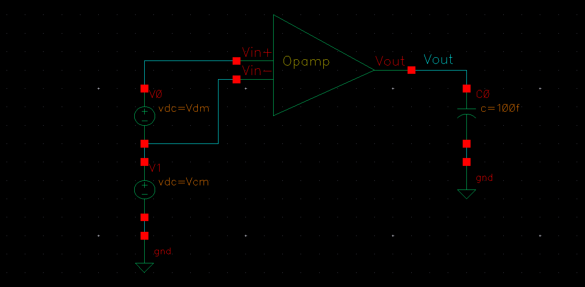
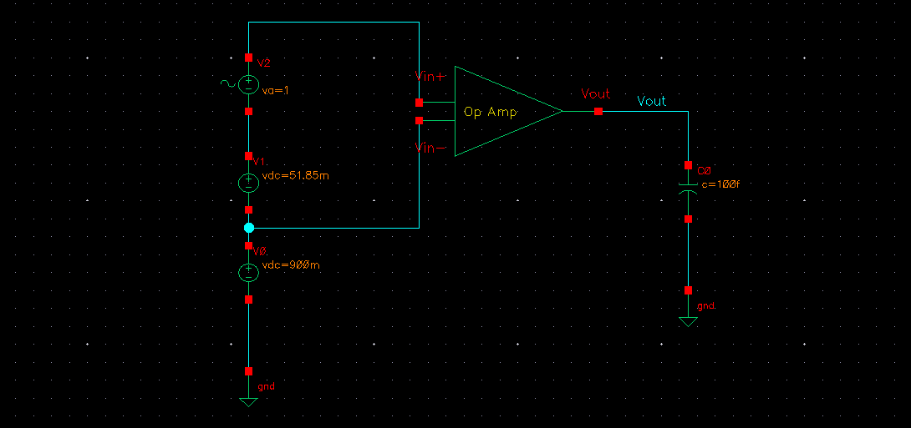
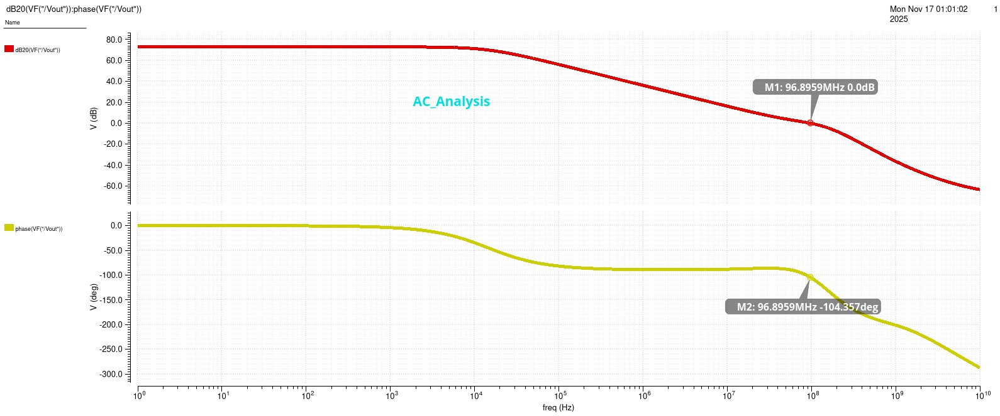
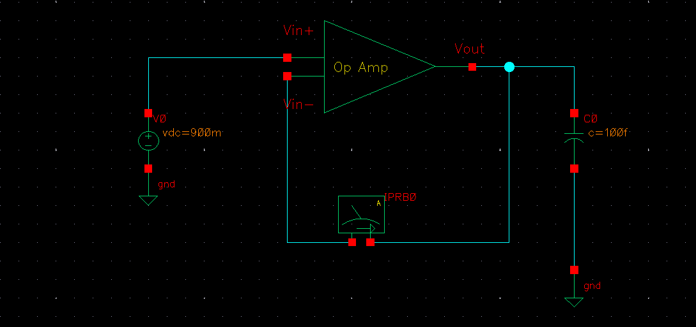
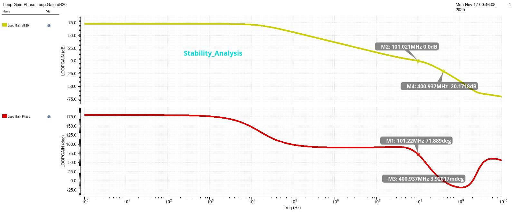
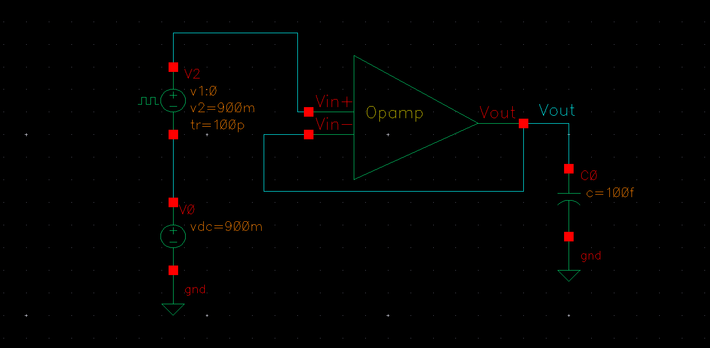

# 🔋 Two-Stage Miller Compensated CMOS Op-Amp

## 📌 Overview

This project presents the **design and simulation of a two-stage CMOS operational amplifier** using **Cadence Virtuoso (GPDK 180nm technology)**. The design targets **high gain, wide bandwidth, and stable operation** using Miller compensation.

---

## 🧠 Architecture

* **Two-stage amplifier design:**

  * Stage 1: Differential input pair with current mirror load
  * Stage 2: Common-source gain stage
* **Miller compensation (Cc)** for dominant pole control
* **Zero-nullifying resistor (Rz)** for stability improvement
* Tail current source for proper biasing

---

## 🔧 Design Specifications

* **Technology:** GPDK 180 nm
* **Supply Voltage:** 1.8 V
* **Load Capacitance:** 100 fF
* Designed for low-power analog signal processing

---

## ⚙️ Design Methodology

* Hand calculations for biasing and initial sizing
* **gm/Id methodology** for transistor sizing
* Pole-zero analysis for stability
* Frequency compensation using Miller technique
* Simulation using Cadence Virtuoso

---

## 📊 DC Analysis

### 🔹 Testbench


---

### 🔹 Open-Loop Gain


---

### 🔹 Key Results
- **DC Gain:** 72.95 dB  
- **CMRR:** 53 dB  
- **Power Dissipation:** 14.4 µW  

---

### 🔹 Operating Range
- **ICMR:** 540 mV – 1.23 V  
- **OCMR:** 55 mV – 1.513 V  

---

## 📈 AC Analysis

### 🔹 Testbench



### 🔹 Frequency Response



### 🔹 Key Results

* **Unity Gain Frequency:** 96.89 MHz
* **Phase Margin:** 75.6°

---

## 🔁 Stability Analysis

### 🔹 Testbench



### 🔹 Response



### 🔹 Key Results

* **Gain Margin:** 20.17 dB
* **Phase Margin:** ~72°

👉 Ensures stable closed-loop operation

---

## ⚡ Transient Analysis

### 🔹 Testbench



### 🔹 Key Results

* **Slew Rate (+):** 46.62 V/µs
* **Slew Rate (−):** 51.12 V/µs

👉 Demonstrates strong dynamic performance

---

## 📂 Project Structure

```
Two-Stage-OpAmp/
│
├── schematics/   # Circuit schematics (Cadence)
├── results/      # Simulation outputs (plots)
├── docs/         # Project report
└── README.md
```

---

## 🚀 How to Run
1. Open **Cadence Virtuoso**
2. Create and design the two-stage CMOS op-amp schematic
3. Configure testbenches for DC, AC, and transient analysis
4. Run simulations using ADE (Analog Design Environment)
5. Analyze results to verify gain, bandwidth, phase margin, and slew rate

---

## 💡 Key Learning Outcomes

* CMOS analog circuit design
* Two-stage op-amp architecture
* Miller compensation and stability
* gm/Id-based transistor sizing
* Simulation using Cadence Virtuoso

---

## 🏁 Conclusion

The designed op-amp achieves:

* High gain and wide bandwidth
* Stable operation with sufficient phase margin
* Low power consumption
* Good transient response

👉 Suitable for **low-power analog applications**

---

## 👨‍💻 Author

**Vedant Saxena**
